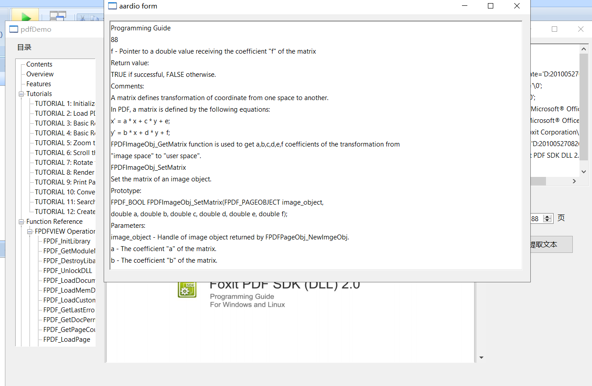

# PDFium-aardio
> PDFium是Google著名开源项目Chromium的一部分，这部分代码就是福昕的技术中比较核心的引擎代码，它比较底层和基础，能够支持PDF的阅读、搜索、打印和文档/表单的填写。开发者可以在此基础上开发出比较简单的PDF应用

经过我的实际使用经验来看,PDFium解析PDF的完整度要好于python的著名项目`pdfminer ` ,尤其是解析带签名的合同制式时,pdfminer经常丢失内容.PDFium暂时没发现有此类问题,且对中文支持友好.

dll下载地址:https://github.com/xuncv/PDFium-aardio/releases/download/0.0.1/pdfium.dll

依赖项目:

1. [pdfium - Git at Google (googlesource.com)](https://pdfium.googlesource.com/pdfium/)
2. [bblanchon/pdfium-binaries: 📰 Binary distribution of PDFium (github.com)](https://github.com/bblanchon/pdfium-binaries) (pdfium去掉v8核心的预编译动态库)

