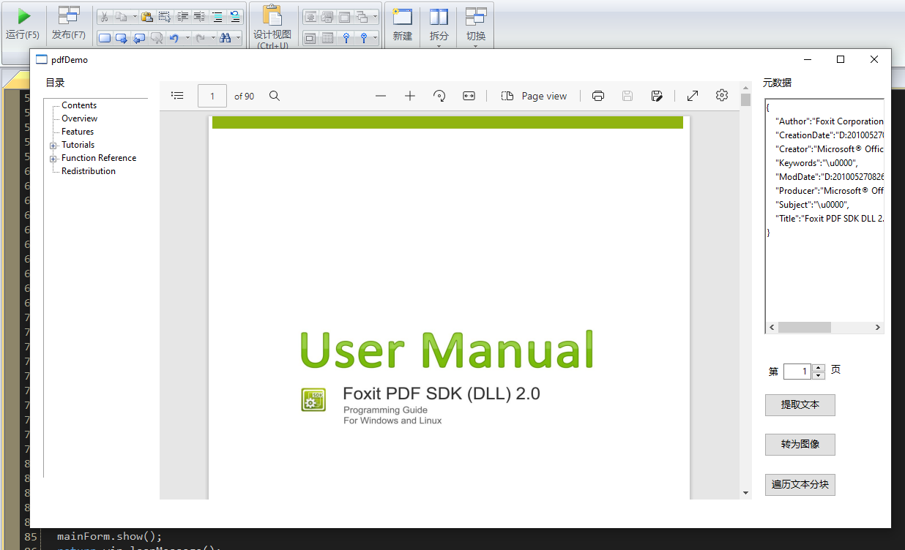

# PDFium-aardio
PDFium 是 Google 著名开源项目 Chromium 的一部分，也是福昕的技术中比较核心的引擎代码。它比较底层和基础，能够支持 PDF 的阅读、搜索、打印和文档/表单的填写。开发者在此基础上可以开发比较简单的 PDF 应用。  

经过我的实际使用来看，PDFium 解析 PDF 的完整度要好于 Python 的著名项目 `pdfminer ` ，尤其是解析带签名的合同制式时，PDFMiner 经常丢失内容，PDFium 暂时没发现有此类问题，且中文支持较好。


# 示例:

载入 PDF

```javascript
import fsys.pdfium; //已收录到 aardio 自带扩展库，首次引用自动安装
var pdf = fsys.pdfium("test.pdf")
```

提取树形目录

```javascript
//加载目录
var bm = pdf.extractBookmarks()
mainForm.treeview.insertItem( bm.asTree() )

//改变当前节点
mainForm.treeview.onSelChanged = function(hItem,data,nmTreeView){
	if(data){
		pdf.pageNum = data.pageIndex;//设置当前页码，起始页码为 1
		
		//wb 为 web.view 对象
		wb.go("/FoxitPDF_SDK20_Guide.pdf#page="+data.pageIndex)  
		mainForm.editPageNum.text = data.pageIndex; 
	} 	
}
```

提取某页文本

```javascript
pdf.pageNum = 8; //设置当前页码，起始页码为 1

var text = pdf.extractText();`
```

遍历某页文本块,带坐标数据
```javascript
import console
reader.pageNum = 8; //设置当前页码，起始页码为 1
for left,top,right,bottom,text in reader.eachTextRect(){
	console.log(left,top,right,bottom,text)
}
```

#### 依赖项目:

1. [pdfium - Git at Google (googlesource.com)](https://pdfium.googlesource.com/pdfium/)
2. [bblanchon/pdfium-binaries: 📰 Binary distribution of PDFium (github.com)](https://github.com/bblanchon/pdfium-binaries) ( PDFium 去掉 V8 核心的 DLL 动态库)
	



